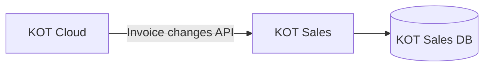

# KOT Cloud sąskaitų sinchronizavimo API — perdavimo specifikacija KOT Cloud komandai

**Dokumento data:** 2026-07-13
**Auditorija:** KOT Cloud komanda ir jų Cursor agentas
**Šaltinis:** `docs/KOT_SALES_INVOICE_INTEGRATION_ANALYSIS.md` (KOT Sales analizė)
**Statusas:** perdavimo specifikacija — sprendimas dėl produkcinio perjungimo dar nepriimtas

> Šis dokumentas yra savarankiškas. KOT Cloud agentui **nereikia** prieigos prie KOT Sales repozitorijos. Visi KOT Sales faktai paimti iš aukščiau nurodytos analizės; nurodyti jos skyriai.
>
> API laukų, endpointų ir enum pavadinimai pateikti **angliškai**; paaiškinimai — lietuviškai. Galutiniai pavadinimai gali būti suderinti su KOT Cloud konvencijomis, jeigu išlaikoma semantika.

---

## 6.1. Santrauka vadovui ir programuotojui

KOT Sales iki šiol sąskaitas gaudavo iš **Sąskaita123**. Nuo 2026-07-13 sąskaitos išrašomos **KOT Cloud**, o istorinės Sąskaita123 sąskaitos jau perkeltos į KOT Cloud. KOT Sales dabar reikia gauti sąskaitas iš KOT Cloud vietoje Sąskaita123.

**Kodėl integracijos negalima dabar tiesiog perjungti**

KOT Sales deduplikuoja sąskaitas pagal vienintelį raktą — `invoices.invoice_id` (UNIQUE), kuriame šiuo metu saugomas **Sąskaita123 vidinis sąskaitos ID** (analizė §5.1, §7.1). KOT Cloud vidinis ID greičiausiai yra kitoje ID erdvėje. Jei pradėsime importuoti visas KOT Cloud sąskaitas be susiejimo, kiekviena migruota istorinė sąskaita bus sukurta antrą kartą.

> **Masinis visų KOT Cloud sąskaitų importas be legacy ID susiejimo yra nepriimtinas, nes dabartinis KOT Sales deduplikavimo raktas yra Sąskaita123 vidinis ID.**

**Kas būtina iš KOT Cloud (4–6 dalykai)**

1. Kiekvienai migruotai sąskaitai grąžinti originalų Sąskaita123 ID (`legacy_saskaita123_invoice_id`).
2. Kiekvienai sąskaitai grąžinti nekintantį KOT Cloud ID (`id`) ir kilmę (`origin`).
3. Serverio valdomą pakeitimų srautą su opaque cursor (`GET /invoices/changes`).
4. Serverio sugeneruotą pradinį **cutover cursor**, garantuojantį, kad nė viena nauja/pakeista sąskaita nebus praleista.
5. Aiškų projekto / tenant / seller scope duomenų izoliacijai.
6. Patvirtinimą dėl `created_at` / `updated_at` semantikos po migracijos.

**Rekomenduojamas modelis: A + B**

- **A — Legacy ID susiejimas:** migruotos sąskaitos neša ir KOT Cloud ID, ir Sąskaita123 ID.
- **B — Serverio pakeitimų cursor:** po cutover KOT Sales skaito tik naujus ir pakeistus įrašus per cursor srautą, ne pagal sąskaitos datą.

**Ką būtina patvirtinti prieš implementaciją**

Žr. [6.20 Blokuojantys klausimai](#620-blokuojantys-klausimai). Kritiniai: legacy ID egzistavimas ir grąžinimas, `updated_at` perrašymas migracijoje, cutover cursor prieinamumas.

**Go / No-Go kriterijus**

> Jeigu nėra legacy Sąskaita123 ID arba patikimo vienkartinio mapping, produkcinis perjungimas yra **NO-GO**.

---

## 6.2. Sistemos ribos



| Aspektas | Reikšmė |
|---|---|
| Šaltinio sistema po cutover | **KOT Cloud** (sąskaitų išrašymas ir saugojimas) |
| Ką KOT Sales skaito | Sąskaitų **antraštės** duomenis per changes API |
| Ką KOT Sales kuria/keičia KOT Cloud | **Nieko** — integracija yra **read-only** iš KOT Cloud pusės |
| Ką KOT Sales rašo | Tik į savo DB (`invoices`, agregatai) |
| Izoliacija | KOT Cloud turi grąžinti tik sutarto **project / tenant / seller** sąskaitas; kitų klientų duomenys negrąžinami |

KOT Sales nėra KOT Cloud tiesos šaltinis. KOT Cloud lieka autoritetu sąskaitų duomenims.

---

## 6.3. KOT Sales minimalus duomenų poreikis

Laukai paimti iš analizės **§6 (Laukų žemėlapis)** ir **§10–§11**. KOT Sales šiuo metu saugo **tik antraštę** — sąskaitų eilutės, PDF ir pilnas būsenų modelis **nėra** MVP dalis (analizė §1, §6).

| KOT Cloud API laukas | Tipas | Nullable | Semantika | KOT Sales paskirtis | MVP / vėliau |
|---|---|---|---|---|---|
| `id` | string | ne | Nekintantis KOT Cloud sąskaitos ID | Naujų sąskaitų dedup raktas (`invoices.invoice_id` arba `kot_cloud_invoice_id`) | **MVP būtina** |
| `legacy_saskaita123_invoice_id` | string | taip | Originalus Sąskaita123 ID migruotoms | Susiejimas su esamu `invoices.invoice_id` (analizė §7.1) | **MVP būtina (cutover)** |
| `origin` | enum | ne | `saskaita123` \| `kot_cloud` | Atskirti migruotą nuo naujos | **MVP būtina** |
| `project_id` | string | pagal auth | Duomenų scope / tenant | Izoliacija, kad nepatektų kitų sąskaitos (analizė §17 kriterijus 14) | **Reikalinga cutover** |
| `created_at` | string (RFC 3339, UTC) | ne | Sukūrimo laikas (semantika — žr. 6.9) | Audit, diagnostika | **Reikalinga cutover** |
| `updated_at` | string (RFC 3339, UTC) | ne | Paskutinio pakeitimo laikas | Diagnostika, reconciliation | **Reikalinga cutover** |
| pakeitimo seka (`change_id` / cursor) | string | ne | Monotoniška serverio seka | Inkrementinis sync be tarpų | **MVP būtina** |
| `date` | string (`YYYY-MM-DD`) | ne | Sąskaitos išrašymo (dokumento) data | `invoices.invoice_date`; KPI, analitika (analizė §6) | **MVP būtina** |
| `total` | string (decimal) | ne | Bendra sąskaitos suma | `invoices.amount`; revenue, KPI (analizė §6) | **MVP būtina** |
| `series_title` | string | taip | Serijos pavadinimas (pvz. `VK-000`) | `invoices.series_title`; PVM filtras `VK-%` (analizė §7.5) | **MVP būtina** |
| `series_number` | integer | taip | Serijos numeris | `invoices.series_number`; display numeris | **MVP būtina** |
| `client.id` | string | taip | Kliento ID | `invoices.client_id` | **MVP būtina** |
| `client.code` | string | taip | Įmonės kodas | `invoices.company_code`; jei tuščias — KOT Sales generuoja `PERSON_*` (analizė §6) | **MVP būtina** |
| `client.name` | string | taip | Įmonės / kliento pavadinimas | `invoices.company_name` | **MVP būtina** |
| `client.vat_code` | string | taip | PVM kodas | `invoices.vat_code` | **MVP būtina** |
| `client.address` | string | taip | Adresas | `invoices.address` | **MVP būtina** |
| `client.email` | string | taip | El. paštas | `invoices.email` | **MVP būtina** |
| `client.phone` | string | taip | Telefonas | `invoices.phone` | **MVP būtina** |
| `issued_to` | string | taip | Gavėjo pavadinimas, jei nėra `client` objekto | Fallback `company_name` (analizė §6) | **MVP būtina** (jei `client` gali nebūti) |
| `currency` | string (ISO 4217) | taip | Valiuta | Šiuo metu KOT Sales nesaugo; reikalinga jei ne vien EUR (analizė §6, §19) | **Galima vėliau** |
| `document_type` | enum | taip | invoice / credit / proforma | KOT Sales dabar sprendžia per serijos prefiksą (`VK-000KR`, `VK-000IS`) (analizė §7.5) | **Galima vėliau** |
| `migration_batch_id` | string | taip | Migracijos partija | Auditui / cutover patikrai | **Reikalinga cutover** |

**Grupavimas pagal prioritetą**

1. **MVP būtina:** `id`, `origin`, `date`, `total`, `series_title`, `series_number`, `client.*` (arba `issued_to`), pakeitimo seka/cursor, `legacy_saskaita123_invoice_id`.
2. **Reikalinga patikimam cutover:** `project_id`, `created_at`, `updated_at`, `migration_batch_id`.
3. **Galima vėliau:** `currency`, `document_type`, eilutės, PDF, mokėjimo būsenos.

> Eilutės, PDF ir statusai **nepridedami** kaip MVP reikalavimas, nes KOT Sales jų dabar nenaudoja (analizė §6, §10).

---

## 6.4. ID ir kilmės semantika

### `id`

- Nekintantis KOT Cloud sąskaitos identifikatorius.
- Nekeičiamas per visą sąskaitos gyvavimo laiką.
- Niekada nepernaudojamas kitai sąskaitai.
- Tipas ir maksimalus ilgis turi būti dokumentuoti (pvz. `string`, ≤ 64 simboliai).
- KOT Sales traktuoja jį kaip **opaque** reikšmę (nedekoduoja, neparsina).

### `legacy_saskaita123_invoice_id`

- **Privalomas** visoms migruotoms Sąskaita123 sąskaitoms.
- `null` naujoms KOT Cloud sukurtoms sąskaitoms.
- Turi būti **identiškas** ID, kurį anksčiau grąžino Sąskaita123 API ir kurį KOT Sales saugo `invoices.invoice_id` (analizė §5.1, §7.1).
- Stabilus per visą gyvavimo laiką.
- Unikalus tinkamame **project / seller** scope.
- **Negali** būti generuojamas iš sąskaitos numerio (analizė §7.4 — numeris nėra patikimas raktas).

### `origin`

Rekomenduojamos loginės reikšmės:

```text
saskaita123   # migruota iš Sąskaita123
kot_cloud     # sukurta tiesiogiai KOT Cloud
```

KOT Cloud gali naudoti kitus enum pavadinimus, bet privalo aiškiai atskirti migruotą ir KOT Cloud sukurtą įrašą.

### `migration_batch_id`

- Rekomenduojamas auditui ir cutover patikrai.
- Identifikuoja konkrečią migracijos partiją.
- **Negali** būti naudojamas kaip vienintelis deduplikavimo raktas.

### Unikalumo klausimai (KOT Cloud turi atsakyti)

- Ar `id` globaliai unikalus, ar tik projekto / tenant ribose?
- Ar `legacy_saskaita123_invoice_id` unikalus globaliai ar scope viduje?
- Ar keli juridiniai asmenys gali turėti tuos pačius sąskaitos numerius ar legacy ID?

### Rekomenduojamas KOT Sales loginis modelis (KOT Sales atsakomybė)

```text
KOT Sales invoice
├── legacy_saskaita123_invoice_id   # susiejimui su istoriniu įrašu
├── kot_cloud_invoice_id            # naujas nekintantis ID
└── source / origin
```

arba atskira nuorodų lentelė:

```text
invoice_external_references
├── invoice_id        # KOT Sales vidinis
├── source_system     # 'saskaita123' | 'kot_cloud'
└── external_id
```

> Tikslus KOT Sales DB sprendimas yra **KOT Sales atsakomybė**. KOT Cloud reikalavimas — patikimai pateikti abu ID ir kilmę. **Nesiūloma** aklai perrašyti seno `invoice_id` nauju KOT Cloud ID, neįvertinus legacy susiejimo praradimo, ID kolizijų ir pakartotinių istorinių pakeitimų (analizė §13 Variantas A).

---

## 6.5. Pakeitimų srauto API kontraktas

Siūlomas semantinis endpointas (kelias gali būti pritaikytas KOT Cloud konvencijoms):

```http
GET /api/v1/invoices/changes
```

### Užklausos parametrai

| Parametras | Tipas | Privalomas | Semantika |
|---|---|---|---|
| `cursor` | string | ne pirmai užklausai | Opaque serverio cursor; grąžinamas ankstesniame atsake |
| `limit` | integer | ne | Puslapio dydis; default ir max dokumentuojami (žr. 6.13) |
| `project_id` | string | pagal auth modelį | Duomenų scope; gali būti implicit iš tokeno |
| `include_migrated` | boolean | tik jei reikalinga | Ar grąžinti migracijos istoriją; **nereikia**, jei cutover cursor ir change log išsprendžia problemą |

### Puslapiavimo taisyklės

- Rezultatai rūšiuojami pagal **serverio pakeitimų seką didėjančiai** (stabilus rūšiavimas).
- `cursor` yra **opaque**; klientas jo **nekuria ir nedekoduoja**.
- Puslapį galima **saugiai pakartoti** (idempotentiškas GET).
- `next_cursor` KOT Sales išsaugo **tik pilnai sėkmingai** apdorojus visą puslapį.
- Nauji pakeitimai, atsiradę puslapiavimo metu, **neprarandami**.
- Vienodas timestamp keliems įrašams **negali** sukelti praleidimo — todėl cursor turi remtis seka, ne vien laiku.
- **Backdated** sąskaita vis tiek patenka į srautą pagal pakeitimo įvykį (ne pagal `date`).
- Tuščias puslapis: `items: []`, `has_more: false` — reiškia „šiuo metu naujų pakeitimų nėra“.
- Cursor **galiojimo / retention** laikotarpis turi būti dokumentuotas.
- Turi būti aišku, ką daryti pasibaigus cursor galiojimui (žr. 6.12 `invalid_cursor`).

### Atsako forma (papildyta KOT Sales antraštės laukais)

```json
{
  "items": [
    {
      "change_id": "chg_000001234",
      "change_type": "upsert",
      "invoice": {
        "id": "inv_kc_01HZX9",
        "legacy_saskaita123_invoice_id": "123456",
        "origin": "saskaita123",
        "project_id": "project_01",
        "date": "2024-05-10",
        "total": "1250.00",
        "currency": "EUR",
        "series_title": "VK-000",
        "series_number": 28828,
        "client": {
          "id": "cli_001",
          "code": "304433393",
          "name": "UAB Pavyzdys",
          "vat_code": "LT100000000",
          "address": "Gatvė 1, Vilnius",
          "email": "info@example.lt",
          "phone": "+37060000000"
        },
        "created_at": "2024-05-10T08:15:10.123Z",
        "updated_at": "2026-07-13T06:30:00.000Z"
      }
    }
  ],
  "next_cursor": "opaque-cursor",
  "has_more": false
}
```

### Sprendimai, kuriuos KOT Cloud turi patvirtinti

- Ar `change_id` būtinas? (Rekomenduojama **taip** — stabiliam sekos raktui.)
- Ar `change_type` gali būti `upsert`, `cancel`, `delete`?
- Ar KOT Sales MVP pakanka `upsert`? (Dabartinis KOT Sales apdoroja tik upsert; cancel/credit šiuo metu tvarkomas UI filtru pagal serijos prefiksą — analizė §7.5.)
- Kaip pateikiamas atšaukimas, ištrynimas ir kreditinė sąskaita?
- Ar visas antraštės payload pateikiamas pačiame changes sraute, ar reikia papildomo detail endpointo?

> **Pirmenybė:** pilnas KOT Sales reikalingas **antraštės payload viename atsake**, kad nereikėtų N+1 užklausų.

---

## 6.6. Cutover ir pradinis cursor

Kalendorinė perėjimo data — **2026-07-13**, tačiau KOT Cloud turi patvirtinti:

- tikslų momentą (UTC);
- laiko zoną;
- ar tai buvo prieš, ar po istorinių duomenų migracijos;
- ar po migracijos ir prieš integracijos įjungimą jau buvo išrašyta naujų sąskaitų (analizė §14.9).

### Rekomenduojamas procesas

1. KOT Cloud patvirtina migracijos partiją (`migration_batch_id`).
2. KOT Cloud patvirtina, kad **visos** migruotos sąskaitos turi `legacy_saskaita123_invoice_id`.
3. KOT Cloud pateikia **serverio sugeneruotą pradinį cursor**, garantuotai apimantį visas naujas ir pakeistas sąskaitas nuo sutarto cutover taško.
4. KOT Sales atlieka **dry run**:
   - migruoti įrašai susiejami per legacy ID;
   - nauji KOT Cloud įrašai pažymimi kaip kuriami;
   - konfliktai **neišsaugomi** automatiškai.
5. Palyginami kiekiai, ID ir sumų agregatai.
6. Tik tada įjungiamas realus importas.
7. Pirmasis realus importas pradedamas nuo patvirtinto cursor.
8. Cursor įrašomas **tik po pilnai sėkmingo puslapio**.

> **Pradinį cursor pateikia KOT Cloud** (serverio pusė). Jo semantika: „visi pakeitimų įvykiai nuo šio taško (imtinai / neįskaitant — turi būti aiškiai apibrėžta) bus grąžinti be tarpų.“

### Antras geriausias variantas (jei cutover cursor neįmanomas)

- change log nuo serverio **UTC momento**;
- stabilus `(changed_at, change_id)` raktas;
- **persidengiantis** langas;
- **privalomas** legacy ID deduplikavimas;
- dry run prieš rašymą.

> Vien `invoice.date >= 2026-07-13` **nėra priimtinas** (backdated ir migracijos `updated_at` rizikos — analizė §8.4, §13 Variantas B).

---

## 6.7. Istorinių sąskaitų elgesys

### Migruota sąskaita, niekada nepakeista po migracijos

- KOT Sales **neturi** jos kurti iš naujo (ji jau egzistuoja su Sąskaita123 ID).
- Du variantai:
  - **(a)** palikti nesusietą (be `kot_cloud_invoice_id`) iki pirmo pakeitimo;
  - **(b)** susieti vienkartinio reconciliation metu (žr. 6.8).
- **Rekomendacija:** jei įmanoma, atlikti vienkartinį reconciliation susiejimą (b), kad vėlesnis pirmasis pakeitimas nesukeltų dviprasmybės. Jei reconciliation eksportas nepasiekiamas — priimtina (a), nes pakeitimo event atneš ir legacy ID (analizė §13 Variantas A + §14).

### Migruota sąskaita, pakeista po migracijos

- KOT Cloud change event turi turėti **ir** KOT Cloud `id`, **ir** `legacy_saskaita123_invoice_id`.
- KOT Sales randa esamą įrašą pagal legacy ID.
- KOT Sales priskiria / išsaugo KOT Cloud ID.
- **Dublikatas nekuriamas.**

### Nauja sąskaita, sukurta KOT Cloud

- `legacy_saskaita123_invoice_id = null`;
- `origin = kot_cloud`;
- KOT Sales kuria naują įrašą pagal KOT Cloud `id`;
- jos `date` gali būti **ankstesnė** už cutover (backdated);
- ją vis tiek turi sugauti **change cursor** (ne datos filtras).

---

## 6.8. Reconciliation endpointas arba dry-run eksportas

Įvertinimas, ar prieš cutover reikia atskiro mechanizmo susiejimui / patikrai:

### Variant 1 — tas pats changes endpointas su pradiniu migration cursor

Tinka, jeigu KOT Cloud turi **pilną patikimą change log**, apimantį ir migracijos įvykius. Minimalus, jei change log patikimas.

### Variant 2 — sąskaitų sąrašas reconciliation tikslui

```http
GET /api/v1/invoices?migration_batch_id=...
```

Turėtų grąžinti bent: KOT Cloud `id`, `legacy_saskaita123_invoice_id`, `origin`, project / seller scope, pagrindinius kontrolinius laukus (`date`, `total`, `series_*`).

### Variant 3 — vienkartinis anonimizuotas mapping eksportas (CSV / JSON)

```text
legacy_saskaita123_invoice_id,kot_cloud_invoice_id,origin,migration_batch_id
```

**Rekomendacija:**

- **Minimalus:** Variant 1 (jei change log pilnas ir patikimas).
- **Rekomenduojamas:** Variant 2 arba Variant 3 vienkartiniam susiejimui + kiekių/sumų patikrai prieš cutover.

> Mapping eksportas ar reconciliation endpointas **nepakeičia** nuolatinio changes endpointo — jis lieka pagrindiniu inkrementiniu šaltiniu.

---

## 6.9. Datos ir laiko taisyklės

- Timestamp formatas: **RFC 3339 / ISO 8601**.
- Visi techniniai timestamp — **UTC su `Z`** (pvz. `2026-07-13T06:30:00.000Z`).
- Sąskaitos dokumento data (`date`) — **`YYYY-MM-DD`** (kalendorinė data, be laiko zonos).
- `created_at` semantika — KOT Cloud turi aiškiai nurodyti: originalus sukūrimas šaltinyje **ar** importas į KOT Cloud.
- `updated_at` semantika — verslo duomenų pakeitimas **ar** techninė migracija.
- Rekomenduojama atskira `migrated_at` reikšmė, jei migracija palietė timestamp.
- Cursor **neturi** remtis vien kliento perduotu laiku.
- Vienodi timestamp turi būti atskiriami **sekos ID** (`change_id`).
- Backdated sąskaitos gaunamos pagal **change event** laiką, ne pagal `date`.

> **KOT Cloud privalo aiškiai atsakyti, ar migracijos metu buvo perrašyti `created_at` ir `updated_at`.** Tai tiesiogiai lemia, ar `updated_at`-pagrįstas filtras saugus (analizė §8.4, §13 Variantas B).

---

## 6.10. Skaičių, pinigų ir laukų formatas

Pagal KOT Sales naudojamus laukus (analizė §6):

- Pinigų reikšmės — **decimal string**, ne float (pvz. `"1250.00"`), kad nebūtų tikslumo praradimo.
- Valiuta — **ISO 4217** (pvz. `EUR`).
- Decimal tikslumas turi būti dokumentuotas (rekomenduojama 2 skaitmenys po kablelio pinigams).
- `null` ir tuščia eilutė (`""`) turi skirtingą reikšmę; KOT Sales `company_name` tuščią reikšmę traktuoja kaip „nežinoma“ (analizė §6).
- Aiškiai pažymėti privalomus ir optional laukus.
- Numerių ir kodų maksimalūs ilgiai dokumentuojami.
- Koduotė — **UTF-8**.
- Enum reikšmės išvardytos (`origin`, `change_type`, `document_type`).
- Sąskaitos numeris atskirtas: `series_title` (pvz. `VK-000`) + `series_number` (integer) — KOT Sales juos sujungia į display numerį (analizė §6, §7.4).
- Numerio unikalumas: KOT Cloud turi nurodyti, ar numeris unikalus tik **seller / project / series** ribose.

> **Sąskaitos numeris nėra pagrindinis techninis ID** ir negali būti naudojamas deduplikacijai (analizė §7.4).

---

## 6.11. Autentifikacija ir autorizacija

Rekomenduojamas **service-to-service** modelis:

- **Bearer token** arba KOT Cloud standartinis server-to-server mechanizmas (KOT Sales dabartinis Sąskaita123 klientas naudoja `Authorization: Bearer <token>` — analizė §3, §11.2).
- Tik **skaitymo** scope, pvz. `invoices:read`.
- **Project / tenant apribojimas** — tokenas mato tik sutarto projekto sąskaitas.
- Jokių kitų klientų sąskaitų.
- Tokeno **rotacija** (naujas → deploy → senas revoke).
- Paslaptys tik aplinkos kintamuosiuose (rekomenduojami pavadinimai KOT Sales pusėje: `KOT_CLOUD_API_KEY`, `KOT_CLOUD_API_BASE_URL`, `KOT_CLOUD_PROJECT_ID`).
- Tokenai ir pilnas `Authorization` header **neloginami**.
- Audituojama, kas ir kada kvietė endpointą (`request_id`).

> Realios paslaptys šiame dokumente **nepateikiamos**.

---

## 6.12. Klaidų kontraktas

Rekomenduojamas formatas:

```json
{
  "error": {
    "code": "invalid_cursor",
    "message": "Cursor is invalid or expired",
    "request_id": "req_01HZX..."
  }
}
```

| HTTP | Kada | Retryable? |
|---|---|---|
| `400` | Neteisingi parametrai | Ne |
| `401` | Neteisinga / pasibaigusi autentifikacija | Ne (po token atnaujinimo — taip) |
| `403` | Nėra prieigos prie projekto | Ne |
| `404` | Nerastas resursas (jei naudojamas detail endpointas) | Ne |
| `409` | Konfliktas (jei taikoma) | Priklauso |
| `422` | Semantiškai neteisinga užklausa | Ne |
| `429` | Rate limit; privalomas **`Retry-After`** | **Taip** (su backoff) |
| `5xx` | Laikina serverio klaida | **Taip** (su backoff) |

Papildomai nurodyti:

- **request / correlation ID** kiekviename atsake (ir sėkmės, ir klaidos).
- Aiškiai išskirti **retryable** ir **non-retryable** klaidas.
- **Cursor expired** elgesys: koks `code`, ar reikia gauti naują pradinį cursor, ar tęsti nuo paskutinio žinomo.
- Ar **viena bloga sąskaita** gali sugadinti visą puslapį (rekomenduojama — **ne**; blogas įrašas praleidžiamas su aiškiu žymėjimu, kaip KOT Sales daro dabar — analizė §9.2).
- Kaip KOT Cloud identifikuoja neteisingą įrašą atsake.

---

## 6.13. Rate limit, timeout ir našumas

KOT Cloud komanda turi pateikti:

- maksimalų `limit` (KOT Sales dabar naudoja 50 / puslapį; Sąskaita123 leidžia iki 500 — analizė §11.3);
- rate limit (užklausų per minutę / sekundę);
- rekomenduojamą polling dažnį (KOT Sales dabar tick’ina kas **15 min** — analizė §3, §8);
- atsako timeout reikalavimą (KOT Sales fetch timeout ~10 s — analizė §9.1);
- maksimalų payload dydį;
- cursor **retention** laikotarpį;
- ar palaikomas **gzip**;
- ar yra **sandbox / staging** endpointas.

> **Webhook nėra būtinas MVP.** Dabartinė KOT Sales architektūra — polling (analizė §8). Webhook gali būti vėlesnis optimizavimas, bet **cursor endpointas privalo išlikti** reconciliation šaltiniu.

---

## 6.14. KOT Cloud agento atliekami patikrinimai

Užduotis KOT Cloud agentui: patikrinti savo repozitorijoje ir prie **kiekvieno** atsakymo pateikti (a) failo kelią, (b) modelio / funkcijos pavadinimą, (c) DB migracijos ar schemos nuorodą; jei nepatvirtinta — aiškų **„nežinoma“**.

1. Kur saugomos sąskaitos?
2. Koks jų nekintantis ID?
3. Ar migruotoms sąskaitoms išsaugotas Sąskaita123 ID?
4. Kokiame lauke jis saugomas?
5. Ar jis unikalus? Kokiame scope?
6. Ar yra migracijos partijos ID?
7. Ar `created_at` ir `updated_at` buvo perrašyti migracijos metu?
8. Ar yra audit / change log?
9. Ar iš jo galima sukurti cursor feed?
10. Ar change log apima insert, update, cancel ir delete?
11. Ar sąskaitos gali būti redaguojamos po išrašymo?
12. Ar galimos backdated sąskaitos?
13. Ar viename projekte yra keli seller juridiniai asmenys?
14. Koks esamas auth modelis?
15. Kokios API versijavimo taisyklės?
16. Ar yra testinė aplinka (sandbox)?
17. Ar galima pateikti anonimizuotą migruotos ir naujos sąskaitos payload?
18. Kiek naujų KOT Cloud sąskaitų jau sukurta nuo cutover?
19. Ar buvo sąskaitų pakeitimų po migracijos?
20. Ar galima sugeneruoti tikslų pradinį cursor?

---

## 6.15. KOT Cloud implementacijos darbų sąrašas

Vykdyti **po** kritinių klausimų patvirtinimo. Kiekvienas darbas pažymėtas: **MVP** / **Prieš produkcinį cutover** / **Vėliau**.

| # | Darbas | Prioritetas |
|---|---|---|
| 1 | Patvirtinti arba pridėti legacy Sąskaita123 ID lauką | **MVP** |
| 2 | Pridėti indeksą / uniqueness taisyklę tinkamame scope | **MVP** |
| 3 | Patvirtinti arba pridėti `origin` | **MVP** |
| 4 | Patvirtinti arba pridėti `migration_batch_id` | **Prieš produkcinį cutover** |
| 5 | Sukurti invoice change log arba naudoti esamą audit log | **MVP** |
| 6 | Sukurti cursor-based changes endpointą | **MVP** |
| 7 | Pridėti auth ir project scoping | **MVP** |
| 8 | Pridėti pagination ir stable ordering | **MVP** |
| 9 | Pridėti request ID ir klaidų kontraktą | **MVP** |
| 10 | Paruošti sandbox fixtures | **Prieš produkcinį cutover** |
| 11 | Parašyti automatinius testus (žr. 6.17) | **Prieš produkcinį cutover** |
| 12 | Paruošti cutover cursor | **Prieš produkcinį cutover** |
| 13 | Paruošti dry-run mapping eksportą arba reconciliation endpointą | **Prieš produkcinį cutover** |
| 14 | Pateikti anonimizuotus payload pavyzdžius | **MVP** |
| 15 | Dokumentuoti rate limit ir cursor retention | **Prieš produkcinį cutover** |

> KOT Cloud agentui **nenurodoma** keisti KOT Sales kodo.

---

## 6.16. Atsakomybių matrica

| Darbas | KOT Cloud | KOT Sales | Bendrai |
|---|---|---|---|
| Legacy ID išsaugojimas | ✅ pateikia | — | patikra |
| KOT Cloud stable ID | ✅ | — | — |
| Changes endpointas | ✅ | — | kontrakto suderinimas |
| Cutover cursor | ✅ generuoja | naudoja | ✅ suderinimas |
| KOT Sales DB schema abiem ID | — | ✅ | — |
| KOT Sales deduplikavimas | — | ✅ | — |
| KOT Sales cursor saugojimas | — | ✅ | — |
| Dry run | pateikia duomenis | ✅ vykdo | ✅ rezultatų peržiūra |
| Skaičių palyginimas | pateikia agregatus | ✅ lygina | ✅ |
| Produkcinis perjungimas | pasirengimas | ✅ vykdo | ✅ koordinacija |
| Rollback | palaiko cursor | ✅ vykdo | ✅ |
| Monitoringas | API pusė | KOT Sales pusė | ✅ |

> **`companies.total_revenue` perskaičiavimo problema yra KOT Sales atsakomybė, ne KOT Cloud API atsakomybė** (analizė §5.2, §7.3; žr. skyrių 8 žemiau).

---

## 6.17. Priėmimo kriterijai KOT Cloud API

1. Migruota sąskaita grąžina tikslų legacy Sąskaita123 ID.
2. Nauja KOT Cloud sąskaita turi `legacy_saskaita123_invoice_id = null`.
3. Abiejų tipų sąskaitos turi stabilų KOT Cloud `id`.
4. Tą patį cursor puslapį pakartojus gaunami tie patys loginiai pakeitimai.
5. Po puslapio gautas `next_cursor` nepraleidžia tarpinių įrašų.
6. Vienodu laiku pakeistos kelios sąskaitos neprarandamos.
7. Backdated nauja sąskaita patenka į changes feed.
8. Migruotos sąskaitos pakeitimas grąžina ir KOT Cloud ID, ir legacy ID.
9. Kito projekto sąskaitos negrąžinamos.
10. `429` turi `Retry-After`.
11. Kiekvienas klaidos atsakas turi `request_id`.
12. Cursor galiojimo semantika dokumentuota.
13. Pradinis cutover cursor apima visas naujas sąskaitas nuo sutarto momento.
14. API pateikia visus KOT Sales MVP antraštės laukus (6.3).
15. Decimal reikšmės nepraranda tikslumo.
16. API turi automatinius testus:
    - first page;
    - multiple pages;
    - replay (to paties puslapio pakartojimas);
    - concurrent insert;
    - concurrent update;
    - migrated invoice;
    - new invoice;
    - backdated invoice;
    - invalid cursor;
    - expired cursor;
    - auth scope (kito projekto izoliacija).

---

## 6.18. Cutover kontrolinis sąrašas

### Prieš cutover

- [ ] Patvirtintas tikslus cutover UTC laikas.
- [ ] Patvirtinta migracijos partija (`migration_batch_id`).
- [ ] Patikrintas legacy ID užpildymas (visos migruotos turi legacy ID).
- [ ] Patikrintas legacy ID unikalumas.
- [ ] Patvirtinta `created_at` ir `updated_at` semantika.
- [ ] Sugeneruotas pradinis cursor.
- [ ] Pateikti testiniai payload.
- [ ] Atliktas dry run.
- [ ] Konfliktų skaičius lygus 0 arba išspręstas.
- [ ] KOT Sales pusėje įdiegta dviejų ID schema.
- [ ] KOT Sales pusėje įdiegti testai.
- [ ] Paruoštas rollback.

### Cutover metu

- [ ] Sustabdytas senasis Sąskaita123 polling.
- [ ] Užfiksuotas paskutinis jo checkpoint (KOT Sales `invoice_bootstrap_checkpoint` / `invoice_sync_state` — analizė §5.3, §5.5).
- [ ] Paleistas KOT Cloud sync nuo sutarto cursor.
- [ ] Patikrinti pirmo puslapio įrašai.
- [ ] Patikrinta, kad istoriniai įrašai nesidubliuoja.
- [ ] Patikrintos nuo 2026-07-13 sukurtos naujos sąskaitos.

### Po cutover

- [ ] Palyginti sąskaitų kiekiai.
- [ ] Palygintos sumos pagal dieną / įmonę.
- [ ] Patikrinti dublikatų indikatoriai.
- [ ] Patikrintos klaidos ir retry.
- [ ] Senasis integracijos kelias paliktas rollback laikotarpiui, bet neaktyvus.
- [ ] Po stabilizacijos pašalinti laikini mechanizmai.

---

## 6.19. Rollback

Rollback turi:

- sustabdyti KOT Cloud polling;
- išsaugoti paskutinį sėkmingą KOT Cloud cursor;
- **neleisti** aklai trinti jau korektiškai importuotų įrašų;
- identifikuoti KOT Cloud importuotus įrašus per **source ir external ID** (`origin` + `kot_cloud_invoice_id`);
- leisti atnaujinti integraciją nuo paskutinio cursor;
- **nenaudoti** masinio duomenų ištrynimo kaip numatyto rollback;
- turėti aiškų sprendimą, ar seną Sąskaita123 API dar galima laikinai paleisti.

> Rollback galimybė **priklauso** nuo to, ar Sąskaita123 integracija ir prieigos dar bus prieinamos. KOT Sales turi tai patvirtinti prieš cutover.

---

## 6.20. Blokuojantys klausimai

| # | Klausimas | Kodėl blokuoja | Kas atsako | Būtina iki |
|---|---|---|---|---|
| 1 | Ar migruotoms sąskaitoms išsaugotas tikslus Sąskaita123 ID? | Be jo neįmanomas dedup su esamu `invoice_id` | KOT Cloud | Prieš dizainą |
| 2 | Ar API gali jį grąžinti? | KOT Sales susiejimas per legacy ID | KOT Cloud | Prieš dizainą |
| 3 | Ar migruotos sąskaitos turi kitą KOT Cloud ID? | Lemia, ar reikia dviejų ID schemos | KOT Cloud | Prieš dizainą |
| 4 | Ar migracija perrašė `created_at` / `updated_at`? | Lemia, ar galima cursor pagal laiką | KOT Cloud | Prieš cutover |
| 5 | Ar egzistuoja change log ir cutover cursor? | Be jų nėra saugaus inkrementinio srauto | KOT Cloud | Prieš cutover |
| 6 | Koks tikslus cutover UTC momentas? | Pradinio cursor atskaitos taškas | KOT Cloud | Prieš cutover |
| 7 | Kiek naujų sąskaitų jau sukurta po cutover? | Rizika prarasti tarpinio periodo sąskaitas | KOT Cloud | Prieš cutover |
| 8 | Ar galimos backdated sąskaitos? | Datos filtras nesaugus | KOT Cloud | Prieš dizainą |
| 9 | Ar istorines sąskaitas galima keisti / atšaukti / kredituoti? | Lemia update / cancel semantiką | KOT Cloud | Prieš dizainą |
| 10 | Koks tenant / project / seller scope garantuoja izoliaciją? | Kad nepatektų kitų klientų sąskaitos | KOT Cloud | Prieš dizainą |

> **Jeigu nėra legacy Sąskaita123 ID arba patikimo vienkartinio mapping, produkcinis perjungimas yra NO-GO.**

---

## 7. JSON pavyzdžiai (anonimizuoti)

Visi pavyzdžiai papildyti tikrais KOT Sales reikalingais antraštės laukais iš analizės §6.

### 7.1. Migruota, nepakeista sąskaita

```json
{
  "id": "inv_kc_01HZX9ABCD",
  "legacy_saskaita123_invoice_id": "123456",
  "origin": "saskaita123",
  "migration_batch_id": "mig_2026_07_13_001",
  "project_id": "project_01",
  "date": "2024-05-10",
  "total": "1250.00",
  "currency": "EUR",
  "series_title": "VK-000",
  "series_number": 28828,
  "client": {
    "id": "cli_001",
    "code": "304433393",
    "name": "UAB Pavyzdys",
    "vat_code": "LT100000000",
    "address": "Gatvė 1, Vilnius",
    "email": "info@example.lt",
    "phone": "+37060000000"
  },
  "created_at": "2024-05-10T08:15:10.123Z",
  "updated_at": "2024-05-10T08:15:10.123Z"
}
```

### 7.2. Nauja KOT Cloud sąskaita

```json
{
  "id": "inv_kc_01J0AA1234",
  "legacy_saskaita123_invoice_id": null,
  "origin": "kot_cloud",
  "migration_batch_id": null,
  "project_id": "project_01",
  "date": "2026-07-14",
  "total": "480.50",
  "currency": "EUR",
  "series_title": "VK-000",
  "series_number": 30001,
  "client": {
    "id": "cli_777",
    "code": "302000000",
    "name": "MB Naujoji",
    "vat_code": "LT200000000",
    "address": "Taikos pr. 5, Kaunas",
    "email": "sales@nauja.lt",
    "phone": "+37061111111"
  },
  "created_at": "2026-07-14T09:00:00.000Z",
  "updated_at": "2026-07-14T09:00:00.000Z"
}
```

### 7.3. Migruotos sąskaitos update event

```json
{
  "change_id": "chg_000005678",
  "change_type": "upsert",
  "invoice": {
    "id": "inv_kc_01HZX9ABCD",
    "legacy_saskaita123_invoice_id": "123456",
    "origin": "saskaita123",
    "migration_batch_id": "mig_2026_07_13_001",
    "project_id": "project_01",
    "date": "2024-05-10",
    "total": "1300.00",
    "currency": "EUR",
    "series_title": "VK-000",
    "series_number": 28828,
    "client": {
      "id": "cli_001",
      "code": "304433393",
      "name": "UAB Pavyzdys",
      "vat_code": "LT100000000",
      "address": "Gatvė 1, Vilnius",
      "email": "info@example.lt",
      "phone": "+37060000000"
    },
    "created_at": "2024-05-10T08:15:10.123Z",
    "updated_at": "2026-07-15T11:22:33.000Z"
  }
}
```

### 7.4. Cursor puslapis (tuščias)

```json
{
  "items": [],
  "next_cursor": "opaque-cursor-xyz",
  "has_more": false
}
```

---

## 8. `total_revenue` — svarbi KOT Sales pastaba

- Dabartinis KOT Sales kodas `companies.total_revenue` keičia **tik INSERT** metu (trigger `handle_new_invoice` yra `AFTER INSERT` — analizė §5.2, §7.3).
- Sąskaitos **UPDATE** iš KOT Cloud (pvz. pakeista suma) savaime **nepakoreguos** įmonės agregato.
- Tai yra **KOT Sales techninė skola**, ne KOT Cloud API problema.
- KOT Cloud turi pateikti **teisingus atnaujintus** sąskaitos duomenis.
- KOT Sales komanda turi nuspręsti (prieš leidžiant istorinių sumų update į produkciją):
  - perskaičiuoti tik skirtumą;
  - perskaičiuoti visos įmonės agregatą;
  - arba nepriimti sumos pakeitimų po importo.

> KOT Cloud komanda **netaiso** KOT Sales agregatų, tačiau turi patvirtinti, ar **išrašytų sąskaitų sumos gali būti keičiamos** (susiję su 6.20 klausimu #9).

---

## 9. Dabartinis vienos dienos lookback — statusas

- Dabartinis KOT Sales lookback (1 diena + 30/90 d. reconciliation) sumažina datos ribos riziką (analizė §8).
- Jis **neišsprendžia**:
  - backdated dokumentų;
  - po senesnės datos atliktų update;
  - vienodų timestamp;
  - puslapiavimo konkurencijos;
  - migracijos metu perrašyto `updated_at`.
- Todėl naujame modelyje **pagrindinė garantija turi būti serverio cursor** (6.5, 6.6).
- Lookback gali likti kaip **periodinis reconciliation**, jeigu naudojamas stabilus **abiejų ID** deduplikavimas.

---

## 10. Apribojimai (šio etapo)

- KOT Sales kodas ir DB schema **nekeisti**.
- Integracija **neperjungta**.
- OpenAPI failas **nekurtas** (gali būti pridėtas tik kaip neprivalomas priedas vėliau).
- Realių tokenų / prisijungimų **nėra**.
- KOT Cloud vidinė schema **nespėliojama** kaip faktas — neaiškūs dalykai suformuluoti kaip patikrinimo užduotys (6.14, 6.20).
- KOT Sales faktai paremti analize (`docs/KOT_SALES_INVOICE_INTEGRATION_ANALYSIS.md`) su skyrių nuorodomis.

---

*Dokumentas parengtas tiesioginiam perdavimui KOT Cloud komandai. Papildomo žodinio paaiškinimo nereikia.*
