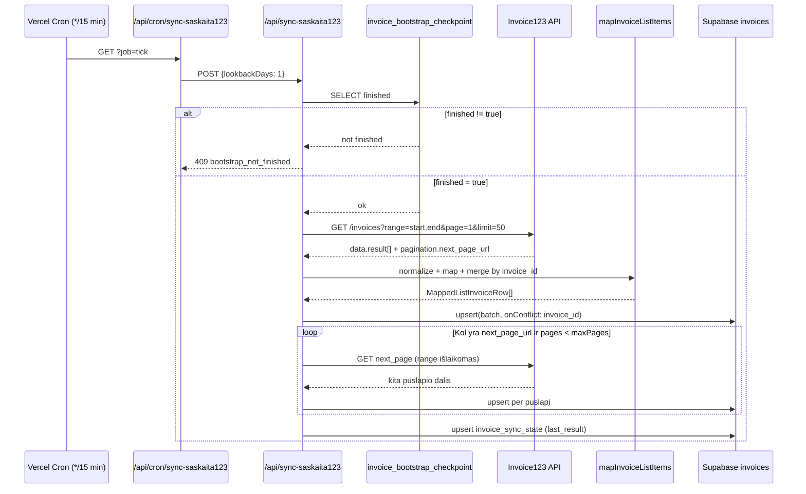

# KOT Sales sąskaitų integracijos analizė (Sąskaita123 → KOT Cloud)

**Dokumento data:** 2026-07-13  
**Repozitorija:** KOT Sales (`salex`)  
**Analizės tipas:** tik skaitymas — jokia integracija nekeista, produkcija neperjungta

---

## Sprendimo santrauka (TL;DR)

| Klausimas | Atsakymas |
|---|---|
| **Ko minimaliai reikia iš KOT Cloud API** | `GET /invoices` su puslapiavimu, datos filtru (`range` arba ekvivalentu), ir laukais: nekintamas `id`, `date`, `total`, `client` (arba `issued_to`), `series_title`, `series_number`. **Kritinė:** `legacy_saskaita123_invoice_id` migruotoms sąskaitoms. |
| **Siūlomas deduplikavimo raktas** | **Esamas:** `invoices.invoice_id` (UNIQUE). **Perėjimui:** pirma ieškoti pagal `legacy_saskaita123_invoice_id` → esamas `invoice_id`; naujoms sąskaitoms — KOT Cloud nekintamas `id`. |
| **Siūlomas cutover mechanizmas** | **Variantas A (legacy ID susiejimas) + B (cursor po cutover)** hibridas: vienkartinis susiejimas migruotoms sąskaitoms, tada tik nauji/pakeisti įrašai per serverio cursor. |
| **Ar reikia vienkartinio istorinių susiejimo** | **Taip**, jei KOT Cloud naudoja naujus ID migruotoms sąskaitoms (labai tikėtina). **Ne**, jei KOT Cloud išlaikė tuos pačius ID kaip Sąskaita123. |
| **Blokuojantys klausimai** | Žr. [§16](#16-klausimai-kot-cloud-komandai) — ypač legacy ID, `updated_at` migracijos metu, cursor semantika, numerio unikalumas. |

**Kritinė rizika:** dabartinis KOT Sales deduplikavimas remiasi **tik** `invoice_id`, kuris šiuo metu yra **Sąskaita123 vidinis ID**. Jei KOT Cloud grąžins kitokius ID be legacy nuorodos, **perjungti integracijos dabar negalima** — bus masiniai dublikatai.

---

## 1. Santrauka

KOT Sales gauna sąskaitas iš **Invoice123** (`https://app.invoice123.com/api/v1.0/invoices`) per tris sinchronizacijos kanalus:

1. **Bootstrap** — istorinis importas su DB checkpoint (`invoice_bootstrap_checkpoint`)
2. **Inkrementinis sync** — kas 15 min, 1 dienos lookback langas
3. **Reconciliation** — 30/90 dienų persidengiantis perskaičiavimas, 5 dienų gabalais

Visi kanalai naudoja tą patį mapping sluoksnį (`lib/invoice123/invoices-list.ts`) ir deduplikuoja per **`upsert` su `onConflict: "invoice_id"`**.

Saugojama tik **sąskaitos antraštė** (be eilučių, be būsenų, be PDF). Klientų agregatai (`companies`, `v_client_list_from_invoices`) atnaujinami **tik INSERT** metu — upsert UPDATE neperskaičiuoja `total_revenue`.

Perėjimui į KOT Cloud būtina:
- patvirtinti, ar migruotų sąskaitų ID sutampa su esamais `invoices.invoice_id`;
- jei ne — API turi grąžinti `legacy_saskaita123_invoice_id`;
- pridėti `source_system` / `kot_cloud_invoice_id` schemoje;
- pakeisti API klientą ir env kintamuosius;
- **neimportuoti visų KOT Cloud sąskaitų iš naujo** be susiejimo.

---

## 2. Analizės apimtis ir ribos

### Kas analizuota

- Visi `saskaita123` / `invoice123` / `sync-saskaita123` failai repozitorijoje
- Susijusios DB migracijos (`supabase/migrations/0001`–`0077`, `0011`, `0069`, `0074`)
- Cron konfigūracija (`vercel.json`)
- CRM sąskaitų vartotojai (`/klientai/saskaitos`, KPI, projektų analitika)
- `.env.example` (konfigūracijos aprašas)

### Kas nebuvo atlikta

| Veiksmas | Priežastis |
|---|---|
| DB statistikos užklausos (§11) | `DATABASE_URL` nepasiekiamas šioje aplinkoje |
| KOT Cloud API tikrinimas | API dar neįgyvendintas / nepasiekiamas |
| Integracijos keitimas | Aiškiai draudžiama šiame etape |
| Slaptų reikšmių atskleidimas | Saugumo reikalavimas |

### Žymėjimo konvencija

- **Patvirtinta kode** — rasta repozitorijoje
- **Patvirtinta DB schemoje** — migracijoje
- **Patvirtinta konfigūracijoje** — `vercel.json`, `.env.example`, env naudojimas kode
- **Rekomendacija** — siūloma, bet neįgyvendinta
- **Nežinoma / reikia patvirtinti** — reikia KOT Cloud arba produkcijos duomenų

---

## 3. Dabartinės Sąskaita123 integracijos komponentų inventorius

| Komponentas | Failas / simbolis | Paskirtis | Kaip paleidžiamas | Pastabos |
|---|---|---|---|---|
| Inkrementinis sync API | `app/api/sync-saskaita123/route.ts` → `POST` | Pagrindinis sync: lookback langas arba pilnas sync | Cron kas 15 min; rankinis POST | Reikalauja `invoice_bootstrap_checkpoint.finished=true` inkrementiniam režimui |
| Bootstrap API | `app/api/sync-saskaita123/bootstrap/route.ts` → `POST` | Istorinis importas su checkpoint | Rankinis POST (gali reikalauti `BOOTSTRAP_SYNC_SECRET`) | Strategijos: `range` (numatyta) arba `page` |
| Reconciliation step | `app/api/sync-saskaita123/reconciliation-step/route.ts` → `POST` | 30/90 d. persidengiantis sync gabalais | Cron `?job=tick`; reikalauja `CRON_SECRET` | `claim_reconciliation_job` RPC |
| Sync status API | `app/api/sync-saskaita123/status/route.ts` → `GET` | Paskutinio sync rezultatas UI | Rankinis GET | Tik observability, nevaldo sync |
| Cron orkestratorius | `app/api/cron/sync-saskaita123/route.ts` → `GET` | Vienas tick: incremental + reconciliation | Vercel Cron `*/15 * * * *` | `?job=tick` |
| Raw proxy | `app/api/saskaita123/route.ts` → `GET` | Tiesioginis Invoice123 atsakas | Bet kas, kas pasiekia endpointą | **Rizika:** nėra auth guard |
| Mapping biblioteka | `lib/invoice123/invoices-list.ts` | API → DB transformacija, dedup | Importuojama sync route'uose | Vienintelis mapping šaltinis |
| Tipai | `lib/invoice123/types.ts` | `Invoice123Client` tipas | — | Atitinka OpenAPI `client` |
| Reconciliation chunking | `lib/invoice123/reconciliation-chunks.ts` | Datų intervalų skaidymas | Reconciliation | 5 dienų gabalai |
| Reconciliation fetch | `lib/invoice123/reconciliation-fetch-step.ts` → `runReconciliationChunkPages` | Vieno gabalo fetch + upsert | Reconciliation step | Laiko/puslapių biudžetas |
| Display numeris | `lib/crm/invoiceDisplayNumber.ts` | `series_title + series_number` formatavimas | UI + sync mapping | OpenAPI nuoroda kode |
| PVM filtras | `lib/crm/vatInvoiceListFilter.ts` | `VK-%` serijos filtras | Tik UI/KPI užklausose | Sync nefiltruoja |
| Sąskaitų sąrašo UI | `app/(crm)/klientai/saskaitos/page.tsx` | Sąskaitų lentelė | SSR puslapis | Slėpia `VK-000IS*`, `VK-000KR*` |
| KPI RPC | `supabase/migrations/0077_*.sql` → `vat_invoices_kpis()` | PVM sąskaitų sumos | RPC iš UI | Neįtraukia IS/KR prefiksų |
| Projektų analitika | `lib/crm/projectAnalytics.ts` | Pajamos pagal sąskaitas | SSR | Filtruoja `VK-%`, ne IS/KR |
| Debug skriptas | `scripts/debug-invoice-numbers.cjs` | Rankinė DB diagnostika | `node scripts/...` | Reikalauja `DATABASE_URL` |
| Cron schedule | `vercel.json` | `*/15 * * * *` | Vercel | — |
| Testai | — | — | — | **Nėra** invoice sync testų |

### Aplinkos kintamieji

**Patvirtinta kode** (naudojami, bet dauguma **nėra** `.env.example`):

| Kintamasis | Paskirtis | Default |
|---|---|---|
| `SASKAITA123_API_KEY` | Bearer token Invoice123 API | — (privalomas) |
| `NEXT_PUBLIC_SUPABASE_URL` | Supabase | — |
| `NEXT_PUBLIC_SUPABASE_ANON_KEY` | Supabase anon key | — |
| `SYNC_INCREMENTAL_LOOKBACK_DAYS` | Inkrementinio lango dienos | `1` (max 180) |
| `SYNC_MAX_PAGES_INCREMENTAL` | Inkrementinio puslapių limitas | `300` (max 500) |
| `SYNC_MAX_PAGES_FULL` | Pilno sync limitas | neribotas |
| `SYNC_INCREMENTAL_TIMEOUT_MS` | Hard timeout | `60000` |
| `SYNC_FULL_TIMEOUT_MS` | Hard timeout pilnam sync | `3600000` |
| `BOOTSTRAP_SYNC_SECRET` | Bootstrap auth | neprivalomas |
| `BOOTSTRAP_BATCH_MAX_INVOICES` | Bootstrap batch dydis | `500` |
| `BOOTSTRAP_MAX_PAGES_PER_RUN` | Bootstrap puslapiai per run | `40` |
| `BOOTSTRAP_RANGE_WINDOW_DAYS` | Datų lango dydis | `120` |
| `BOOTSTRAP_HISTORY_FLOOR` | Seniausia data | `2010-01-01` |
| `BOOTSTRAP_TIMEOUT_MS` | Bootstrap timeout | `180000` |
| `BOOTSTRAP_DEFAULT_STRATEGY` | `range` arba `page` | `range` |
| `BOOTSTRAP_CHECKPOINT_EVERY_PAGES` | Checkpoint dažnumas | `1` |
| `BOOTSTRAP_FETCH_MAX_RETRIES` | Fetch retry | `3` |
| `BOOTSTRAP_FETCH_RETRY_BACKOFF_BASE_MS` | Backoff | `1000` |
| `BOOTSTRAP_DB_MAX_RETRIES` | DB retry | `2` |
| `RECONCILIATION_MAX_PAGES_PER_STEP` | Reconciliation puslapiai | `40` |
| `RECONCILIATION_STEP_BUDGET_MS` | Reconciliation laikas | `50000` |
| `CRON_SECRET` | Reconciliation auth | neprivalomas |
| `SYNC_CRON_TIMEZONE` | Cron laiko zona | `Europe/Vilnius` |
| `SYNC_CRON_WORK_HOURS_START/END` | Darbo valandos | `6`–`22` |
| `SYNC_CRON_DAILY_HOUR` | Reconciliation init valanda | `3` |
| `SYNC_CRON_ALWAYS_ON` | Visada incremental | `true` |

**Rekomendacija** KOT Cloud env:

```bash
KOT_CLOUD_API_BASE_URL=
KOT_CLOUD_API_KEY=
KOT_CLOUD_PROJECT_ID=          # jei reikalingas tenant scope
SYNC_SOURCE_SYSTEM=kot_cloud    # feature flag perėjimui
```

---

## 4. Dabartinis duomenų srautas

### 4.1. Inkrementinis sync (produkcinis kelias)



**Patvirtinta kode** — žingsniai:

1. **Paleidėjas:** Vercel Cron → `GET /api/cron/sync-saskaita123?job=tick` (`vercel.json:4-5`, `cron/route.ts:135-163`)
2. **Proxy:** Cron POST į `/api/sync-saskaita123` su `lookbackDays: 1`
3. **Bootstrap vartai:** Jei `invoice_bootstrap_checkpoint.finished !== true` → HTTP 409 (`route.ts:207-237`)
4. **Datos langas:** `[today - (lookback-1), today]` UTC `YYYY-MM-DD` (`route.ts:193-205`, `invoices-list.ts:307-319`)
5. **Endpoint:** `GET https://app.invoice123.com/api/v1.0/invoices` su `range`, `page`, `limit`
6. **Puslapiavimas:** `pagination.next_page_url`; `range` pririšamas prie kiekvieno URL (`mergeInvoicesListRangeIntoUrl`)
7. **Transformacija:** `parseInvoicesListJson` → `normalizeInvoice123ListRow` → `mapInvoiceListItems` → `mergeMappedRowsByInvoiceId`
8. **Egzistavimo tikrinimas:** implicit per DB `upsert onConflict: invoice_id`
9. **Atnaujinimas:** taip — upsert **perrašo** visus pateiktus stulpelius
10. **Eilutės:** neimportuojamos — tik antraštės suma (`total`)
11. **Dalinė klaida:** blogas įrašas praleidžiamas (`pageErrors`), likę upsertinami; upstream klaida nutraukia puslapį
12. **Checkpoint:** `invoice_sync_state.last_result` — tik statistika, **ne** sync pozicija
13. **Pakartotinis paleidimas:** saugus — idempotentiškas upsert

### 4.2. Bootstrap srautas

**Patvirtinta kode** (`bootstrap/route.ts`):

- Vaikšto atgal per datų langus (`range` strategija) arba puslapius (`page`)
- Checkpoint saugomas `invoice_bootstrap_checkpoint` po kiekvieno puslapio (pagal `BOOTSTRAP_CHECKPOINT_EVERY_PAGES`)
- Baigiasi kai pasiekiamas `BOOTSTRAP_HISTORY_FLOOR` arba nebėra `next_page_url`
- Sumažina datų langą jei Invoice123 puslapių limitas (500) per mažas

### 4.3. Reconciliation srautas

**Patvirtinta kode** (`reconciliation-step/route.ts`, `reconciliation-fetch-step.ts`):

- Sukuria job'ą 30d (daily) arba 90d (monthly) lookback
- Skaido į 5 dienų gabalus
- Kiekvienas cron tick apdoroja vieną step su puslapių/laiko biudžetu
- Resume per `invoice_reconciliation_jobs.next_page_url`

---

## 5. DB modeliai, lentelės, indeksai ir ryšiai

### 5.1. `public.invoices` (pagrindinė lentelė)

**Patvirtinta DB schemoje** — `0005_canonical_lt_crm.sql` + vėlesnės migracijos:

| Stulpelis | Tipas | Šaltinis | Pastabos |
|---|---|---|---|
| `id` | uuid PK | DB generated | Vidinis KOT Sales ID |
| `invoice_id` | text NOT NULL, **UNIQUE** | Invoice123 `id` | **Deduplikavimo raktas** |
| `invoice_number` | text NOT NULL | Derivuotas | `series_title + series_number` arba `invoice_id` |
| `client_id` | text | `client.id` | Invoice123 kliento ID |
| `company_name` | text | `client.name` / `issued_to` | |
| `company_code` | text NOT NULL | `client.code` arba `PERSON_*` | Sintetinis jei nėra kodo |
| `vat_code`, `address`, `email`, `phone` | text | `client.*` | |
| `invoice_date` | date NOT NULL | `date` | Išrašymo data |
| `amount` | numeric NOT NULL | `total` | Suvestinė suma (gali būti sumuota iš eilučių) |
| `series_title` | text | `series_title` | Pvz. `VK-000` |
| `series_number` | int | `series_number` | Pvz. `28828` |
| `invoice_search_display` | text GENERATED | — | Paieškai (`0010`) |
| `created_at`, `updated_at` | timestamptz | DB / sync | `updated_at` sync metu perrašomas mapping'e |

**Indeksai ir constraints:**

- `invoices_invoice_id_key` UNIQUE (`invoice_id`) — **0005:54**
- `invoices_company_code_idx`, `invoices_invoice_date_idx`, `invoices_client_id_idx`
- `invoices_client_key_recent_index` — `(coalesce(company_code, client_id), invoice_date desc, invoice_id desc)` — **0095/0096**

**Ko NĖRA schemoje** (svarbu perėjimui):

- `source_system`
- `legacy_saskaita123_invoice_id` / `kot_cloud_invoice_id`
- `status`, `payment_status`, `cancelled_at`
- `currency`, `vat_amount`, `subtotal`
- Sąskaitų eilučių lentelė
- Importo audit trail

### 5.2. `public.companies`

Agreguoja iš `invoices` per trigger `handle_new_invoice()` — **tik INSERT**.

**Rizika (Patvirtinta DB schemoje):** jei upsert atnaujina sąskaitos `amount`, `companies.total_revenue` **neatsinaujina** (`0005:144-147` — trigger `AFTER INSERT` only).

### 5.3. `public.invoice_bootstrap_checkpoint`

**Patvirtinta DB schemoje** — `0011_invoice_bootstrap_checkpoint.sql`

Vienas įrašas `id='default'`. Laukai: `strategy`, `range_start/end`, `range_next_page`, `finished`, `total_imported_bootstrap`.

### 5.4. `public.invoice_reconciliation_jobs`

**Patvirtinta DB schemoje** — `0069_invoice_reconciliation_jobs.sql`

Lease-based job queue su `claim_reconciliation_job(p_worker_id)` RPC.

### 5.5. `public.invoice_sync_state`

**Patvirtinta DB schemoje** — `0074_invoice_sync_state.sql`

Tik paskutinio sync JSON suvestinė UI — **nenaudojama** kaip sync cursor.

### 5.6. Vaizdai ir RPC

| Objektas | Paskirtis |
|---|---|
| `v_client_list_from_invoices` | Klientų sąrašas iš sąskaitų agregatų |
| `recent_invoices_for_clients()` | Paskutinės 5 sąskaitos klientui |
| `vat_invoices_kpis()` | PVM KPI (VK-%, be IS/KR) |
| `dashboard_sales_analytics_v1` | Pardavimų dashboard |

---

## 6. Laukų žemėlapis

Žemiau — **tik realiai naudojami** laukai. Šaltinis: `mapInvoiceListItems` (`invoices-list.ts:191-305`).

| Domenas | Sąskaita123 šaltinio laukas | KOT Sales laukas / lentelė | Tipas | Privalomas? | Transformacija / default | Naudojimo vieta | Reikalavimas KOT Cloud API |
|---|---|---|---|---|---|---|---|
| **Identifikacija** |
| Išorinis ID | `id` (arba nested `invoice.id`, `invoice_id`) | `invoices.invoice_id` | text | **Taip** | `normalizeInvoice123ListRow` | Upsert raktas, visur | **MVP:** nekintamas `id` |
| Legacy ID | — (dabar = `invoice_id`) | — | — | Perėjimui **taip** | — | Cutover susiejimas | **MVP:** `legacy_saskaita123_invoice_id` nullable |
| Šaltinio sistema | — | — | — | Ne | — | — | **Rekomendacija:** `origin` enum |
| Sąskaitos numeris | `series_title` + `series_number` | `invoices.invoice_number` | text | **Taip** (DB NOT NULL) | `resolveInvoiceNumber()` | UI, paieška, KPI filtras | **MVP:** abu laukai |
| Serija | `series_title` / `seriesTitle` / `series` | `invoices.series_title` | text | Ne (bet kritinis UI) | trim | `VK-%` filtras | **MVP** |
| Serijos numeris | `series_number` / `seriesNumber` | `invoices.series_number` | int | Ne | `Math.trunc` | Display numeris | **MVP** |
| Dokumento tipas | *(implicit per seriją)* | — | — | Ne saugoma | UI filtruoja `VK-%` | Ne IS/KR | **Rekomendacija:** `document_type` |
| Projekto ID | — | — | — | Ne | — | — | **Nežinoma** ar reikalinga |
| **Datos** |
| Išrašymo data | `date` | `invoices.invoice_date` | date (YYYY-MM-DD) | **Taip** | `toISODate()` | KPI, analitika, range filtras | **MVP** |
| Sync metadata | — | `invoices.updated_at` | timestamptz | Auto | `new Date().toISOString()` sync metu | — | **Rekomendacija:** šaltinio `updated_at` |
| Apmokėjimo terminas | — | — | — | Nenaudojama | — | — | Galima vėliau |
| Atšaukimo data | — | — | — | Nenaudojama | — | — | **Rekomendacija** jei atšaukimai keičia sync |
| **Būsenos** |
| Sąskaitos būsena | — | — | — | **Nesaunoma** | — | — | **Ne MVP** (dabartinis kodas neapdoroja) |
| Kreditinė / IS | *(per `invoice_number` prefiksą)* | — | — | Implicit | UI slėpia `VK-000KR*`, `VK-000IS*` | KPI išskyrimas | **Rekomendacija:** `document_type` arba `is_credit` |
| **Pirkėjas** |
| Kliento ID | `client.id` / `client_id` | `invoices.client_id` | text | Ne (bet naudinga) | Pirmas ne-null | Klientų susiejimas | **MVP** |
| Įmonės kodas | `client.code` | `invoices.company_code` | text | **Taip** (DB NOT NULL) | `resolveEffectiveCompanyCode()` → `PERSON_*` fallback | `companies`, klientų sąrašas | **MVP** |
| Pavadinimas | `client.name` / `issued_to` | `invoices.company_name` | text | **Taip** (gali būti `""`) | UNKNOWN → `""` | UI | **MVP** |
| PVM kodas | `client.vat_code` | `invoices.vat_code` | text | Ne | — | Kliento kortelė | Rekomenduojama |
| Adresas | `client.address` | `invoices.address` | text | Ne | — | Kliento kortelė | Galima vėliau |
| El. paštas | `client.email` | `invoices.email` | text | Ne | — | Kanban footer | Galima vėliau |
| Telefonas | `client.phone` | `invoices.phone` | text | Ne | — | Kanban footer | Galima vėliau |
| **Sumos** |
| Bendra suma | `total` | `invoices.amount` | numeric | **Taip** | `asNumber()`; sumuojama jei eilutės dubliuojasi | KPI, analitika, revenue | **MVP** |
| Valiuta | — | — | — | **Nenaudojama** | Implicit EUR? | — | **Nežinoma** |
| PVM suma / be PVM | — | — | — | Nenaudojama | — | — | Galima vėliau |
| **Eilutės** |
| Visi eilučių laukai | API gali grąžinti line-level rows | — | — | **Nenaudojama** | Sumuojama į `total` | — | **Nereikia MVP** |
| **Papildoma** |
| PDF | — | — | — | Nenaudojama | — | — | **Nereikia MVP** |
| Užsakymo / sutarties ID | — | — | — | Nenaudojama | — | — | Galima vėliau |
| Komentarai | — | — | — | Nenaudojama | — | — | Galima vėliau |

### Laukų klasifikacija

| Kategorija | Laukai |
|---|---|
| **Būtini importui** | `id`, `date`, `total`, `client` (arba `issued_to`), `series_title`, `series_number` |
| **Saugomi, bet nekritiniai** | `vat_code`, `address`, `email`, `phone`, `client_id` |
| **Naudinga ateičiai** | `origin`, `legacy_saskaita123_invoice_id`, `document_type`, `updated_at` (šaltinio), `currency` |
| **KOT Sales nereikia** | Eilutės, PDF, mokėjimo terminas, custom fields, webhook payload |

---

## 7. Deduplikavimo ir atnaujinimo logika

### 7.1. Faktinis deduplikavimo raktas

**Patvirtinta kode + DB schemoje:**

```
Deduplikavimo raktas = invoices.invoice_id (UNIQUE)
Šiuo metu invoice_id = Sąskaita123 / Invoice123 vidinis ID (tekstas)
```

- DB: `invoices_invoice_id_key UNIQUE (invoice_id)` — `0005:54`
- Kodas: `.upsert(batch, { onConflict: "invoice_id" })` — `route.ts:557-560`, `bootstrap/route.ts:171-174`, `reconciliation-fetch-step.ts:165-168`

**Nėra** `source_system`, `external_id`, ar numerio-based dedup.

### 7.2. Daugiasluoksnis merge (prieš upsert)

**Patvirtinta kode** (`invoices-list.ts`):

1. `normalizeInvoice123ListRow` — eilutės → antraštė (`id` iš `invoice_id`)
2. `mergeMappedRowsByInvoiceId` — grupavimas per puslapį
3. `mergeInvoiceRowGroup` — sumuoja `amount` jei skirtingi
4. Inkrementiniame: `incrementalMergedById` Map — cross-page merge (`route.ts:347-348, 542-552`)

### 7.3. Insert vs Update

| Aspektas | Elgesys |
|---|---|
| Importo tipas | **Upsert** (insert + update on conflict) |
| Konflikto raktas | `invoice_id` |
| Atnaujinami laukai | Visi mapping'e pateikti stulpeliai |
| `companies` agregatai | **Tik nauji INSERT** — UPDATE neperrašo `total_revenue` |
| Audit trail | Nėra — tik `invoice_sync_state.last_result` JSON |
| Rankiniai pakeitimai | **Nežinoma** ar yra — nėra `manually_edited` flag |

### 7.4. Sąskaitos numerio unikalumas

**Patvirtinta kode:** numeris (`invoice_number`) **nenaudojamas** deduplikacijai.

**Rizika (Rekomendacija įvertinti per DB §11):**
- Tas pats numeris gali egzistuoti skirtingose serijose / įmonėse
- Kreditinės gali turėti panašius numerius (`VK-000KR*`)
- Deduplikacija vien pagal numerį būtų **nesaugi**

### 7.5. Atšaukimai / kreditai

**Patvirtinta kode:**

- Sync **importuoja visus** dokumentus (visos serijos)
- UI/KPI **filtruoja** `series_title ILIKE 'VK-%'` ir ne `VK-000IS%` / `VK-000KR%`
- Nėra atšaukimo būsenos saugojimo ar trynimo logikos
- Jei kreditinė sąskaita atsiranda kaip naujas dokumentas su nauju `invoice_id` — bus importuota, bet paslėpta UI

---

## 8. Inkrementinio sinchronizavimo logika

### 8.1. Dabartinis modelis

**Patvirtinta kode** — **ne tikras `updated_since` cursor**:

| Mechanizmas | Naudojama? | Detalės |
|---|---|---|
| Visos sąskaitos kiekvieną kartą | Ne (production) | Tik tuščioje DB arba `fullSync=true` |
| Datos langas (`range`) | **Taip** | `[today-(N-1), today]` UTC |
| `updated_since` | **Ne** | — |
| Paskutinis sync laikas kaip cursor | **Ne** | `invoice_sync_state` tik observability |
| Paskutinis ID cursor | **Ne** | — |
| Serverio cursor | **Ne** | — |
| Webhook | **Ne** | — |
| Persidengiantis reconciliation | **Taip** | 30d/90d, 5d gabalai |

### 8.2. Checkpoint saugojimas

| Lentelė | Kas saugoma | Ar valdo sync? |
|---|---|---|
| `invoice_bootstrap_checkpoint` | Bootstrap progresas | Taip (tik bootstrap) |
| `invoice_reconciliation_jobs` | Chunk + `next_page_url` | Taip (reconciliation) |
| `invoice_sync_state` | Paskutinio run JSON | **Ne** (tik UI/logs) |

### 8.3. Laiko zona ir datos semantika

- Range datos: **UTC** `YYYY-MM-DD` (`todayUtcIso()`, `addDaysUtc()`)
- Cron darbo valandos: **Europe/Vilnius** (`cron/route.ts:15, 115`)
- `invoice_date` — išrašymo data iš API, ne sync laikas
- Range ribos: **įskaitančios** (`range=start,end`)

### 8.4. Techninės rizikos

| Rizika | Įvertinimas |
|---|---|
| Nėra `updated_since` — praleidžiami pakeitimai už lookback lango | **Vidutinė** — reconciliation kompensuoja (30/90d) |
| `max_pages_cap` — nepilnas langas per vieną run | **Žema** — persidengiantis lookback + idempotent upsert |
| Tas pats `updated_at` keliems įrašams | **Neaktualu** — nenaudojame `updated_at` filtrui |
| Laikrodžio / TZ neatitikimai | **Žema** — filtras pagal `invoice_date`, ne sync timestamp |
| Migracijos metu pakeistas `updated_at` KOT Cloud | **Aukšta** cutover metu — žr. §13 |

---

## 9. Klaidų, retry ir observability elgesys

### 9.1. Dabartinis elgesys pagal sync tipą

| Sync tipas | Upstream retry | Backoff | Timeout | Dalinė klaida | Logging |
|---|---|---|---|---|---|
| Inkrementinis | **Ne** | **Ne** | 10s fetch + 60s hard | Praleidžia blogus įrašus, upsertina gerus | `console.log("[sync-saskaita123] ...")` |
| Bootstrap | **Taip** (iki 3) | Eksponentinis + jitter | 180s default | Meta run lygyje | `[bootstrap]` prefix |
| Reconciliation | **Ne** | **Ne** | 10s fetch + 50s budget | Meta run lygyje | `[reconciliation-step]` |

### 9.2. HTTP klaidų reakcija (inkrementinis)

**Patvirtinta kode** (`route.ts`):

| Statusas | Elgesys |
|---|---|
| 400/422 (1-as puslapis, incremental) | HTTP 502 su pranešimu apie `range` palaikymą |
| Kiti non-2xx | `throw` → HTTP 502, dalinai upsertinti duomenys lieka (incremental) |
| Timeout (hard) | HTTP 504, incremental: jau upsertinti lieka |
| Missing API key | HTTP 500 |

**Ko nėra:** 429 retry, `Retry-After`, correlation ID, struktūruotas error JSON iš upstream.

### 9.3. Observability

- `invoice_sync_state` — paskutinis rezultatas (`/api/sync-saskaita123/status`)
- `invoice_reconciliation_jobs.last_error` — reconciliation klaidos
- Nėra: dedicated audit log, import history, metrics/alerting

### 9.4. Rekomendacija KOT Cloud klientui

- GET saugus pakartoti (idempotent)
- 429 → exponential backoff su `Retry-After`
- 5xx → retry iki 3 kartų
- Vienas blogas dokumentas neturėtų blokuoti puslapio (dabartinis KOT Sales elgesys atitinka)
- Request/correlation ID loguose

---

## 10. Tikslus KOT Cloud API poreikis

Remiantis faktiniu KOT Sales kodu, KOT Cloud API turi palaikyti **bent** Invoice123 list endpoint ekvivalentą:

```
GET {base}/invoices?range={start},{end}&page={n}&limit={n}
Authorization: Bearer {token}
```

**Privalomi atsakymo laukai** (per §6 MVP):

- `id` (nekintamas)
- `date`
- `total`
- `client` objektas (`id`, `code`, `name`, `vat_code`, `address`, `email`, `phone`) **arba** `issued_to`
- `series_title`, `series_number`
- Puslapiavimas: `pagination.next_page_url` (arba cursor ekvivalentas)

**Kritiniai perėjimo laukai** (nežinoma ar bus — **blokuoja**):

- `legacy_saskaita123_invoice_id` — migruotoms sąskaitoms
- `origin` — `kot_cloud` vs `migrated_saskaita123`
- Šaltinio `updated_at` — jei naudosime cursor sync

**Nereikia MVP:**

- Eilučių endpoint
- PDF
- Webhook (galima vėliau)
- Detalės endpoint (list pakanka)

---

## 11. Minimalus KOT Cloud API kontraktas

### 11.1. Endpointų lentelė

| Prioritetas | Metodas ir kelias | Paskirtis | Privalomi parametrai | Atsakas | KOT Sales naudojimas |
|---|---|---|---|---|---|
| **MVP būtina** | `GET /invoices` | Sąskaitų sąrašas | `range` (start,end), `page`, `limit` | `items[]`, `pagination` | Visi 3 sync pipeline |
| **MVP būtina** | — (laukas atsakyme) | Legacy susiejimas | — | `legacy_saskaita123_invoice_id` | Cutover dedup |
| **Rekomenduojama** | `GET /invoices/changes` | Pakeitimų srautas | `cursor`, `limit` | `items[]`, `next_cursor`, `has_more` | Pakeitimų sync po cutover |
| **Rekomenduojama** | `GET /health` | Prieinamumas | — | `200 OK` | Deploy patikra |
| **Galima vėliau** | `GET /invoices/{id}` | Viena sąskaita | `id` | Invoice objektas | Nenaudojama dabar |
| **Galima vėliau** | `GET /invoices/{id}/pdf` | PDF | `id` | PDF/url | Nenaudojama dabar |
| **Galima vėliau** | `POST /webhooks` | Push pranešimai | — | — | Nenaudojama dabar |

### 11.2. Autentifikacija

**Dabartinis (Patvirtinta kode):**

```
Authorization: Bearer {SASKAITA123_API_KEY}
```

**Rekomendacija KOT Cloud:**

| Aspektas | Siūloma |
|---|---|
| Metodas | Bearer token (suderinamumas su dabartiniu kodu) |
| Env | `KOT_CLOUD_API_KEY`, `KOT_CLOUD_API_BASE_URL` |
| Scope | Skaitymas sąskaitų sąrašui |
| Tenant | `project_id` query parametras jei multi-tenant |
| Rotacija | Naujas key → deploy → senas revoke |
| Loguose | **Neloguoti** token, pilno Authorization header |

### 11.3. Puslapiavimas, rūšiavimas, filtrai

**Rekomendacija** (paremta dabartiniais Invoice123 apribojimais):

| Parametras | Reikalavimas |
|---|---|
| Puslapiavimas | `page` + `limit` (MVP) **arba** `cursor` (rekomenduojama changes endpoint) |
| `next_page_url` / `next_cursor` | Būtina |
| `has_more` | Rekomenduojama |
| Max `limit` | ≥ 50 (dabartinis default), max 500 (Invoice123 limitas) |
| `range` | Įskaitančios datos `YYYY-MM-DD` |
| Stabilus rūšiavimas | Rekomenduojama: `invoice_date ASC, id ASC` |
| `origin` filtras | `kot_cloud`, `migrated` — cutover |
| `updated_since` | **Nerekomenduojama** kaip vienintelis mechanizmas |
| Laiko zona | UTC ISO 8601 |
| Tuščias rezultatas | `items: []`, `has_more: false` |

### 11.4. Minimalus atsakymo pavyzdys

**Rekomendacija** — struktūra paremta `mapInvoiceListItems` poreikiais:

```json
{
  "items": [
    {
      "id": "inv_kot_abc123",
      "origin": "migrated_saskaita123",
      "legacy_saskaita123_invoice_id": "inv_s123_xyz789",
      "date": "2026-07-13",
      "total": "1500.00",
      "series_title": "VK-000",
      "series_number": 28828,
      "client": {
        "id": "cli_001",
        "code": "304433393",
        "name": "UAB Pavyzdys",
        "vat_code": "LT100000000",
        "address": "Gatvė 1, Vilnius",
        "email": "info@example.lt",
        "phone": "+37060000000"
      },
      "created_at": "2024-03-15T10:00:00.000Z",
      "updated_at": "2026-07-13T08:15:10.123Z"
    }
  ],
  "pagination": {
    "current_page": 1,
    "last_page": 10,
    "per_page": 50,
    "total": 487,
    "next_page_url": "/api/v1/invoices?page=2&range=2026-07-13,2026-07-13&limit=50"
  }
}
```

**Laukų semantika:**

| Laukas | Tipas | Nullable | Pastaba |
|---|---|---|---|
| `id` | string | ne | **Nekintamas** KOT Cloud ID |
| `legacy_saskaita123_invoice_id` | string | taip | Tik migruotiems; lygiuoti su `invoices.invoice_id` |
| `origin` | enum | ne | `kot_cloud` \| `migrated_saskaita123` |
| `date` | string (date) | ne | Išrašymo data, ne sync data |
| `total` | string (decimal) | ne | Pinigų suma; rekomenduojama string kad išvengti float |
| `series_title` | string | taip | |
| `series_number` | integer | taip | |
| `client.code` | string | taip | Gali būti tuščias — KOT Sales generuoja `PERSON_*` |
| `created_at` | ISO 8601 | ne | **Nežinoma** semantika — žr. §16 |
| `updated_at` | ISO 8601 | ne | Paskutinis pakeitimas šaltinyje |

**Eilutės:** neįtrauktos — KOT Sales jų nenaudoja.

### 11.5. Klaidų atsakai

**Rekomendacija:**

```json
{
  "error": {
    "code": "RATE_LIMITED",
    "message": "Too many requests",
    "correlation_id": "req_abc123"
  }
}
```

| HTTP | KOT Sales elgesys (dabartinis / siūlomas) |
|---|---|
| 400 | Fail su aiškiu pranešimu; dabar: 502 jei range nepalaikomas |
| 401 | 500, log, alert |
| 403 | 500, log |
| 404 | N/A (list endpoint) |
| 409 | N/A |
| 422 | Kaip 400 |
| 429 | **Siūloma:** retry su backoff (dabar: fail) |
| 5xx | **Siūloma:** retry 3x (bootstrap turi; incremental ne) |

---

## 12. Rekomenduojamas KOT Cloud API kontraktas

Papildomai prie §11 minimalaus:

### 12.1. Changes endpoint (rekomenduojama patikimumui)

```
GET /invoices/changes?cursor={opaque}&limit=100
```

| Aspektas | Reikalavimas |
|---|---|
| Cursor | Serverio sugeneruotas, monotoniškas |
| Įvykiai | create, update (cancel/credit kaip update arba naujas doc) |
| Cutover cursor | Vienkartinis `cutover_cursor` po migracijos |
| Idempotentiškumas | Tie patys įrašai su tuo pačiu `updated_at` + `id` |

### 12.2. Cutover metadata endpoint

```
GET /sync/cutover-checkpoint
```

Grąžina:

```json
{
  "cutover_at": "2026-07-13T00:00:00.000Z",
  "initial_cursor": "cursor_after_migration",
  "migrated_invoice_count": 12345,
  "legacy_id_field": "legacy_saskaita123_invoice_id"
}
```

### 12.3. Filtrai kilmės atskyrimui

```
GET /invoices?origin=kot_cloud&range=...
GET /invoices?origin=migrated_saskaita123&range=...
```

---

## 13. Migracijos / cutover variantų palyginimas

### Variantas A — Legacy ID išsaugojimas (REKOMENDUOJAMAS)

| Kriterijus | Įvertinimas |
|---|---|
| Saugumas | **Aukščiausias** |
| KOT Sales schema | Reikia `kot_cloud_invoice_id` stulpelio arba mapping lentelės |
| Esami įrašai | `invoice_id` = Sąskaita123 ID — legacy laukas leidžia susieti |
| Istorinių atnaujinimai | Galimi per legacy match → update by internal uuid |
| KOT Cloud reikalavimas | `legacy_saskaita123_invoice_id` API atsakyme |

### Variantas B — Cursor po migracijos

| Kriterijus | Įvertinimas |
|---|---|
| Saugumas | Geras naujoms sąskaitoms, **ne pakanka** vien dėl istorinių |
| KOT Sales schema | Galima saugoti cursor `invoice_sync_state` arba naujoje lentelėje |
| Rizika | `updated_at` migracijos metu gali sukelti masinį re-importą |
| KOT Cloud reikalavimas | Serverio `cutover_cursor` |

### Variantas C — Filtras pagal kilmę

| Kriterijus | Įvertinimas |
|---|---|
| Saugumas | Geras naujoms (`origin=kot_cloud`) |
| Rizika | Praleidžiami migruotų sąskaitų vėlesni pakeitimai jei filtruojama tik `kot_cloud` |
| Panaudojimas | Kaip papildomas, ne vienintelis |

### Variantas D — Verslo raktas (FALLBACK)

```
seller + series_title + series_number + document_type
```

| Kriterijus | Įvertinimas |
|---|---|
| Saugumas | **Žemas** — kolizijų rizika |
| KOT Sales duomenys | Vienas `company_code` per sąskaitą; nėra seller entity |
| Rekomendacija | Tik dry-run ataskaitai ir rankiniam konfliktų sprendimui |

### Palyginamoji lentelė

| Variantas | Istoriniai dublikatai | Naujos sąskaitos | Pakeitimai po cutover | Įgyvendinimo sudėtingumas |
|---|---|---|---|---|
| A (legacy ID) | Žema rizika | Reikia + A arba B | Gerai | Vidutinis (schema + mapping) |
| B (cursor) | Rizika jei be A | Gerai | Gerai | Žemas/vidutinis |
| C (origin filter) | Žema (jei tik kot_cloud) | Gerai | Blogai migruotiems | Žemas |
| D (verslo raktas) | Vidutinė/aukšta | N/A | N/A | Aukštas (rankinis) |

---

## 14. Rekomenduojamas perėjimo planas

### 14.1. Rekomenduojamas variantas

**A + B hibridas:**

1. KOT Cloud API grąžina `legacy_saskaita123_invoice_id` migruotoms sąskaitoms
2. Vienkartinis susiejimo dry-run: visi esami `invoices.invoice_id` ↔ legacy laukas
3. Po cutover — `GET /invoices/changes?cursor={cutover_cursor}` naujiems ir pakeistiems
4. Papildomas safety net: `origin=kot_cloud` + 1d lookback (kaip dabartinis incremental)

### 14.2. Kodėl saugiausias

- Esami įrašai lieka su Sąskaita123 ID `invoice_id` — nėra masinio re-importo
- Nauji KOT Cloud ID saugomi atskirai — nėra ID konfliktų
- Cursor nepriklauso nuo `updated_at` migracijos artefaktų
- Persidengiantis lookback + upsert lieka safety net

### 14.3. KOT Cloud funkcionalumas

- [ ] `legacy_saskaita123_invoice_id` laukas
- [ ] `origin` laukas
- [ ] `GET /invoices` su `range`, pagination (Invoice123 suderinamumas)
- [ ] `GET /invoices/changes` su cursor (rekomenduojama)
- [ ] `GET /sync/cutover-checkpoint` (rekomenduojama)
- [ ] Sandbox su migruotu + nauju pavyzdžiu
- [ ] Anonimizuoti payload pavyzdžiai

### 14.4. KOT Sales pakeitimai (§15)

### 14.5. Duomenys patikrinti prieš perjungimą

- [ ] Ar KOT Cloud ID = Sąskaita123 ID migruotoms? (jei taip — paprasčiausias cutover)
- [ ] Kiek esamų `invoices` įrašų (`SELECT count(*)`)
- [ ] Ar yra dublikatų `invoice_id` (turėtų būti 0)
- [ ] Ar yra pasikartojančių `invoice_number` skirtingiems `invoice_id`
- [ ] Kiek sąskaitų su `series_title NOT ILIKE 'VK-%'` (ne PVM)
- [ ] Naujų sąskaitų skaičius KOT Cloud po 2026-07-13

### 14.6. Dry run

1. Implementuoti KOT Cloud providerį su `SYNC_SOURCE_SYSTEM=kot_cloud_dry_run`
2. Fetch be DB write — log mapping rezultatus
3. Ataskaita: `matched_by_legacy`, `new_would_create`, `conflicts`
4. Rankinis conflict review (Variantas D tik čia)

### 14.7. Rezultato patikra

- KOT Sales `count(*)` prieš ir po — delta = tik naujos sąskaitos
- Nėra dublikatų `invoice_number` + `invoice_date` + `company_code` su skirtingu `invoice_id`
- KPI sumos nesikeičia reikšmingai (± tik naujos sąskaitos)
- Sync logs: `matched`, `created`, `updated`, `skipped`

### 14.8. Rollback

1. Išjungti KOT Cloud sync (grąžinti `SASKAITA123_API_KEY`)
2. DB nekoreguoti — upsert su senais ID išlaiko duomenis
3. Jei buvo klaidingi insert'ai — identifikuoti per `created_at > cutover_at AND invoice_id NOT IN (legacy set)` ir ištrinti

### 14.9. Sąskaitos tarp migracijos ir integracijos įjungimo

- Naudoti `origin=kot_cloud` + `created_at >= cutover_at` filtrą
- Papildomai: vienkartinis fetch `range=[cutover_date, today]` su legacy dedup
- **Nenaudoti** vien `invoice_date >= cutover` — backdated sąskaitos

### 14.10. Backdated sąskaitos

- Sync pagal **šaltinio sukūrimo/sync cursor**, ne `invoice_date`
- Reconciliation 30d/90d lieka safety net
- KOT Cloud `created_at` semantika **turi būti patvirtinta** (§16)

---

## 15. Būtini KOT Sales pakeitimai

| # | Pakeitimas | Prioritetas | Pastaba |
|---|---|---|---|
| 1 | Naujas `lib/kotCloud/` arba refactor `lib/invoice123/` → generic provider | MVP | Feature flag |
| 2 | DB migracija: `kot_cloud_invoice_id text NULL`, `source_system text DEFAULT 'saskaita123'` | MVP | Arba `invoice_external_refs` lentelė |
| 3 | Mapping: pirmiausia match `legacy_saskaita123_invoice_id`, tada `id` | MVP | Cutover logika |
| 4 | Env: `KOT_CLOUD_API_KEY`, `KOT_CLOUD_API_BASE_URL` | MVP | |
| 5 | `.env.example` papildymas visais sync kintamaisiais | Žemas | Dokumentacija |
| 6 | Upsert strategija: atnaujinti `companies` ir UPDATE trigger | Vidutinis | Dabartinė spraga |
| 7 | Retry/backoff inkrementiniam sync | Vidutinis | Kaip bootstrap |
| 8 | `/api/saskaita123` proxy pašalinimas arba auth | Žemas | Saugumo spraga |
| 9 | Testai: `mapInvoiceListItems`, dedup, cutover matching | Aukštas | Dabar 0 testų |
| 10 | Cursor sync iš `invoice_sync_state` arba naujos lentelės | Rekomenduojama | Jei changes API |

---

## 16. Klausimai KOT Cloud komandai

### Privaloma atsakyti prieš implementaciją

1. Ar migruotoms sąskaitoms KOT Cloud išsaugojo originalų Sąskaita123 sąskaitos ID?
2. Ar API galės jį grąžinti (`legacy_saskaita123_invoice_id` arba lygiavertis laukas)?
3. Ar yra požymis, kad sąskaita migruota vs sukurta KOT Cloud (`origin`)?
4. Ar yra migracijos partijos ID arba tikslus cutover cursor?
5. Ar KOT Cloud `created_at` reiškia originalų sukūrimo laiką, ar importavimo į KOT Cloud laiką?
6. Ar `updated_at` migracijos metu buvo perrašytas visoms istorinėms sąskaitoms?
7. Koks yra nekintantis KOT Cloud sąskaitos ID formatas (pavyzdys)?
8. Ar API gali grąžinti pakeitimus nuo cursor / sekos (ne tik `updated_since`)?
9. Ar sąskaitos po išrašymo gali būti redaguojamos (suma, klientas)?
10. Kaip pateikiamas atšaukimas, kreditavimas ir trynimas?
11. Ar gali būti backdated sąskaitų (sukurtos po cutover, bet senesnė `date`)?
12. Ar sąskaitos numeris (`series_title` + `series_number`) unikalus globaliai, įmonėje, serijoje ar metais?
13. Ar viename KOT Cloud projekte gali būti keli juridiniai asmenys?
14. Ar sąskaitų eilutės turi stabilius ID? (KOT Sales **nereikia** MVP)
15. Ar KOT Sales reikalingas PDF? (**Ne** pagal dabartinį kodą)
16. Kokie API limitai (rate limit, max page size) ir autentifikacijos būdas?
17. Ar yra sandbox su testiniais duomenimis?
18. Ar galima gauti anonimizuotą payload pavyzdį: viena migruota + viena nauja sąskaita?

### Galima patvirtinti vėliau

- Webhook palaikymas ir retry semantika
- `currency` laukas ir valiutų konversija
- Detalės endpoint (viena sąskaita) — dabar nenaudojama
- OAuth2 vietoj Bearer token
- IP allowlist reikalavimai
- Eilučių lygio duomenys (KOT Sales ateityje gali prireikti)
- `document_type` enum standartizavimas (invoice/credit/proforma)

---

## 17. Priėmimo kriterijai

| # | Kriterijus | Dabartinis KOT Sales palaikymas |
|---|---|---|
| 1 | Nauja sąskaita atsiranda vieną kartą | **Taip** — upsert `invoice_id` |
| 2 | Tas pats puslapis kelis kartus — be dublikato | **Taip** — upsert |
| 3 | Pakartotinis sync saugus | **Taip** — idempotent upsert |
| 4 | Istorinės migruotos nesukuriamos antrą kartą | **Ne** — reikia legacy ID logikos |
| 5 | Pakeitimas priskiriamas esamam įrašui | **Taip** — upsert update, bet `companies` ne |
| 6 | Backdated sąskaita neprarandama | **Dalinai** — reconciliation 30/90d; nėra cursor |
| 7 | Puslapiavimo metu nepraleidžiami įrašai | **Dalinai** — `max_pages_cap` rizika, kompensuojama |
| 8 | Nutrūkus tinklui — galima tęsti | **Taip** incremental (per-page upsert); bootstrap checkpoint |
| 9 | 429/5xx su backoff | **Ne** incremental; **Taip** bootstrap fetch |
| 10 | Blogas dokumentas neblokuoja puslapio | **Taip** — `pageErrors`, skip |
| 11 | Atšaukta/kredituota apdorojama | **Ne** — nėra būsenos; tik UI filtras |
| 12 | Sumos sutampa | **Nežinoma** — priklauso nuo API; sumuojamos eilutės |
| 13 | Klientas susiejamas deterministiškai | **Taip** — `resolveEffectiveCompanyCode` |
| 14 | Kito projekto sąskaitos nepatenka | **Nežinoma** — nėra project filter dabartiniame API |
| 15 | Aiškūs logai su source ID | **Dalinai** — console.log, nėra structured audit |

---

## 18. Rizikos ir fallback

| Rizika | Tikimybė | Poveikis | Kaip aptikti | Prevencija | Fallback |
|---|---|---|---|---|---|
| Visų istorinių pakartotinis importas | Aukšta (jei be legacy ID) | Kritinis — dublikatai, neteisingi KPI | Dry-run: `new_would_create` count | Legacy ID matching (Variantas A) | Rollback + delete by `created_at` |
| KOT Cloud ID ≠ Sąskaita123 ID | Aukšta | Kritinis | Palyginti 10 žinomų ID | Legacy laukas API | Verslo raktas (Variantas D) |
| Numerio kolizijos | Vidutinė | Vidutinis | DB query §11 | Dedup tik per ID, ne numerį | Rankinis review |
| Backdated sąskaitos | Vidutinė | Vidutinis | Sync gap analizė | Cursor + reconciliation | Padidinti lookback |
| Migracijos `updated_at` perrašymas | Aukšta | Aukštas | KOT Cloud patvirtinimas | Nenaudoti `updated_since` cutover | `origin` + cursor |
| Prarasti įrašai ties laiko riba | Žema | Vidutinis | Reconciliation stats | Persidengiantis lookback | 30/90d reconciliation |
| Puslapiavimo mutacija sync metu | Žema | Vidutinis | Duplicate count | Cursor su serverio seka | Reconciliation |
| Istorinių redagavimas po perėjimo | Vidutinė | Vidutinis | Changes API | Legacy match + update | Manual re-sync range |
| Kreditinių neatitikimas | Vidutinė | Žemas (UI slepia) | KPI palyginimas | `document_type` laukas | Serijos prefiksų filtras |
| Keli juridiniai asmenys | Nežinoma | Aukštas | KOT Cloud atsakymas | `project_id` filtras | — |
| Apvalinimo skirtumai | Žema | Žemas | Sumų palyginimas | Decimal string formatas | Tolerancija 0.01 |
| Dalinai sėkmingas importas | Vidutinė | Žemas | `pageErrors` log | Per-page upsert (jau yra) | Reconciliation |
| Token galiojimo pabaiga | Žema | Aukštas | 401 alert | Key rotation runbook | Manual key swap |
| Rate limit 429 | Vidutinė | Vidutinis | 429 log | Backoff retry | Padidinti intervalą |
| Per didelis payload | Žema | Vidutinis | Response size monitor | `limit` cap | Mažesnis limit |
| PDF URL galiojimas | N/A | N/A | — | — | — |
| `companies` agregatų neatitikimas po update | Vidutinė | Vidutinis | Revenue sanity check | UPDATE trigger | Periodinis rebuild |
| Neautentifikuotas `/api/saskaita123` | Žema | Aukštas | Security audit | Auth middleware | Endpoint pašalinimas |

### Ar galima perjungti dabar?

**Ne** — kol nepatvirtinta legacy ID semantika ir KOT Cloud API kontraktas. Esamas kodas tiesiogiai naudoja Sąskaita123 ID kaip `invoice_id`; be susiejimo strategijos perėjimas sukurs dublikatus.

---

## 19. Atviri klausimai

| # | Klausimas | Blokuoja? |
|---|---|---|
| 1 | Ar KOT Cloud migruotoms sąskaitoms naudoja tą patį ID kaip Sąskaita123? | **Taip** |
| 2 | Kokia tikslausi cutover data/laikas (UTC)? | Vidutiniškai |
| 3 | Ar yra sąskaitų išrašytų Sąskaita123 po cutover, bet prieš KOT Cloud sync? | Taip |
| 4 | Kiek juridinių asmenų / projektų naudoja sąskaitų API? | Vidutiniškai |
| 5 | Ar valiuta visada EUR? | Ne (MVP) |
| 6 | Ar `code_type` / `country_code` (migracija 0004) reikalingi? | Ne — kodas jų nepopuliuoja |
| 7 | Ar produkcijoje `invoice_bootstrap_checkpoint.finished = true`? | Taip (incremental reikalauja) |
| 8 | DB statistika (§11) — paleisti prieš cutover | Taip |

### DB užklausos paleisti vėliau (DATABASE_URL reikalingas)

```sql
-- 1. Bendras skaičius
SELECT count(*) AS total_invoices FROM public.invoices;

-- 2. Be invoice_id (turėtų būti 0)
SELECT count(*) FROM public.invoices WHERE trim(coalesce(invoice_id,'')) = '';

-- 3. Pasikartojantys invoice_id (turėtų būti 0)
SELECT invoice_id, count(*) FROM public.invoices GROUP BY invoice_id HAVING count(*) > 1;

-- 4. Pasikartojantys invoice_number (skirtingi invoice_id)
SELECT invoice_number, count(DISTINCT invoice_id) AS distinct_ids, count(*) AS rows
FROM public.invoices GROUP BY invoice_number HAVING count(DISTINCT invoice_id) > 1
ORDER BY rows DESC LIMIT 20;

-- 5. Numerio kolizijos tarp company_code
SELECT invoice_number, count(DISTINCT company_code) AS companies
FROM public.invoices GROUP BY invoice_number HAVING count(DISTINCT company_code) > 1
LIMIT 20;

-- 6. Ne VK serijos
SELECT count(*) FROM public.invoices WHERE series_title NOT ILIKE 'VK-%' OR series_title IS NULL;

-- 7. IS/KR prefiksai
SELECT count(*) FROM public.invoices WHERE invoice_number ILIKE 'VK-000IS%';
SELECT count(*) FROM public.invoices WHERE invoice_number ILIKE 'VK-000KR%';

-- 8. Datų diapazonas
SELECT min(invoice_date), max(invoice_date) FROM public.invoices;

-- 9. Valiutos — nėra stulpelio (informacinis)
-- 10. Bootstrap būsena
SELECT finished, total_imported_bootstrap, oldest_invoice_date_seen FROM public.invoice_bootstrap_checkpoint WHERE id='default';
```

---

## 20. Kodo nuorodų priedas

### Pagrindiniai failai

| Kelias | Eilutės / simboliai | Paskirtis |
|---|---|---|
| `lib/invoice123/invoices-list.ts` | `INVOICES_LIST_BASE:40`, `mapInvoiceListItems:191-305`, `mergeMappedRowsByInvoiceId:150-158` | API mapping |
| `app/api/sync-saskaita123/route.ts` | `POST:91-881`, `persistSyncState:122-140`, upsert `557-560` | Inkrementinis sync |
| `app/api/sync-saskaita123/bootstrap/route.ts` | `POST:214-772`, `upsertInvoiceRows:150-212`, `saveCheckpoint:427-453` | Bootstrap |
| `app/api/sync-saskaita123/reconciliation-step/route.ts` | `POST:95-396`, `claim_reconciliation_job:156-158` | Reconciliation |
| `app/api/cron/sync-saskaita123/route.ts` | `GET:111-263` | Cron orkestratorius |
| `lib/invoice123/reconciliation-fetch-step.ts` | `runReconciliationChunkPages:51-209` | Chunk fetch |
| `lib/crm/vatInvoiceListFilter.ts` | `VAT_INVOICE_SERIES_TITLE_ILIKE:9` | UI filtras |
| `lib/crm/invoiceDisplayNumber.ts` | `resolveInvoiceNumber:31-39` | Numerio formatavimas |
| `app/(crm)/klientai/saskaitos/page.tsx` | `HIDE_PREFIXES:34`, query `55-98` | Sąskaitų UI |

### DB migracijos

| Kelias | Turinys |
|---|---|
| `supabase/migrations/0005_canonical_lt_crm.sql` | `invoices`, `companies`, UNIQUE `invoice_id`, trigger |
| `supabase/migrations/0007_invoice_series_display.sql` | `series_title`, `series_number` |
| `supabase/migrations/0008_invoices_anon_update.sql` | Upsert UPDATE teisės |
| `supabase/migrations/0011_invoice_bootstrap_checkpoint.sql` | Bootstrap checkpoint |
| `supabase/migrations/0013_invoices_invoice_number.sql` | `invoice_number` |
| `supabase/migrations/0069_invoice_reconciliation_jobs.sql` | Reconciliation jobs + RPC |
| `supabase/migrations/0074_invoice_sync_state.sql` | Sync state |
| `supabase/migrations/0077_exclude_is_kr_invoices_from_kpis_and_dashboard.sql` | IS/KR išskyrimas |

### Konfigūracija

| Kelias | Turinys |
|---|---|
| `vercel.json` | Cron `*/15 * * * *` → `/api/cron/sync-saskaita123?job=tick` |
| `.env.example` | `CRON_SECRET` komentaras; **nėra** `SASKAITA123_API_KEY` |

### Testai

**Nėra** — `*.test.ts` / `*.spec.ts` failų su `invoice123`, `saskaita123`, `mapInvoiceListItems` nerasta.

---

*Dokumentas parengtas analizės etapui. Implementacijos PR turėtų atnaujinti šį failą su patvirtintais KOT Cloud API atsakymais ir DB statistikos rezultatais.*
